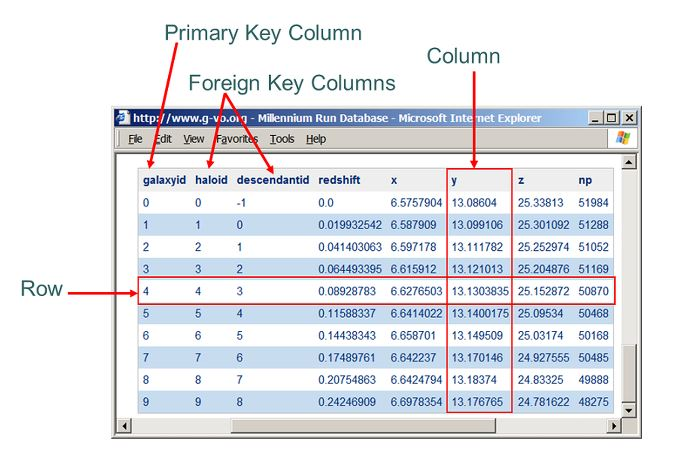

# django 02(Model, Migrations)

django는 templates를 하나로 모아서 보기 때문에 우리가 강제로 중간에 폴더를 하나 끼워넣었었다.


오늘은 Model을 조작해보자.


### Model이란?

- 단일한 데이터에 대한 정보를 가짐
  - 사용자가 저장하는 데이터들의 필수적인 필드들과 동작들을 포함
- 저장된 데이터베이스의 구조
- 장고는 모델을 통해 데이터에 접속하고 관리
- 일반적으로 각각의 모델은 하나의 데이터베이스 테이블에 매핑된다.


### Database

- 데이터베이스는 체계화된 데이터의 모임이다.

### Query

- 쿼리(query)는 데이터를 조회하기 위한 명령어
- 조건에 맞는 데이터를 추출하거나 조작하는 명령어
- 쿼리를 날린다? -> 데이터베이스에 조작하는 명령어를 내린다!


### Database의 구조

- 스키마(Schema): id, title, content, ... 설계 과정에서 주어지는 것들!
  - 데이터베이스에서 자료의 구조, 표현방법, 관계 등을 정의한 구조(Structure)


- 테이블(Table)
  - 필드(Filed)/컬럼(column)/속성  -> 다 같은 용어(열)
  - 레코드(record)/행(row)/튜플   -> 다 같은 용어(행)
  - PK(=id) -> 각 행의 고유값으로, Primary Key의 줄임말이다. PK는 반드시 설정하여야 하며, 데이터베이스 관리 및 관계 설정시 주요하게 활용된다.
  - 장고에서는 PK를 알아서 관리해주기 때문에 따로 신경쓰지 않아도 된다.



출처: https://krksap.tistory.com/541


### django에서의 Model

- 데이터베이스보다는 모델이 큰 개념이라고 할 수 있다. 

- 모델을 통해 데이터를 구조화(데이터베이스로 만든다.)함.
- 결국 웹 어플리케이션의 데이터를 구조화하고 조작하기 위한 도구


### ORM

Object-Relational-Mapping

**객체 지향 프로그래밍 언어를 사용하여 호환되지 않는 유형의 시스템간에(Django-SQL 데이터베이스 언어)데이터를 변환**하는 프로그래밍 기술이다. 가상 객체 데이터베이스를 만들어 사용한다.

-> 호환되지 않는 두 개의 시스템간의 해석을 담당한다.

-> 다시 말해 파이썬 코드로 데이터베이스(SQL코드 등)에 접근하고 수정하는 것을 가능케 해준다.


예를 들어 Database와 우리가 작성하는 python code가 있다면, 데이터베이스는 SQL을 사용하므로 서로 사용하는 언어가 달라 의사소통이 불가능하다. 그래서 ORM이라는 기술이 통역의 역할을 한다. 우리는 OOP 언어인 파이썬을 그대로 쓰고, ORM을 통해 이를 SQL에 전달하고, 반대도 마찬가지인 것!


### ORM을 사용하는 이유?

**장점**

- SQL을 잘 몰라도 DB 조작이 가능
- SQL의 절차적 접근이 아닌 객체 지향적 접근으로 인한 높은 생산성

**단점**

- ORM 만으로 완전한 서비스를 구현하기 어려운 경우가 있음


->현대 웹 프레임워크의 요점은 웹 개발의 속도를 높이는 것(생산성)이므로 ORM을 사용한다.


**서술형!**

**우리는 DB를 객체로 조작하기 위해 ORM을 사용한다**. (서로 다른 시스템의 호환성을 위해)


# 실습1. Model 생성

- curd 프로젝트 생성

- articles 앱 생성
- 앱 등록(settings.py)
- 앱 폴더 안의 models.py에 들어가보면 딱히 작성된 건 없지만, 필수적으로 써야할 것 같은 models라는 것이 import 되어 있다.
- 우리는 데이터베이스를 객체로 조작한다고 했다. 즉, 모델을 하나하나 클래스로 만들 것이다. 하나의 테이블을 만들기 위해서는 하나의 클래스가 대응이 된다.
- 게시판을 만든다고 할 때, 테이블은 하나하나의 게시글을 담는 역할을 할 것이다.
- 프레임워크는 코어 개발에만 집중할 수 있도록 도와주는데, 모델 역시 구현을 도와준다.

### model 작성

1) **모델의 핵심 틀을 구현해놓은 장고의 models의 Model 클래스를 상속받을 것이다.**

2) id, title, content 세 개의 column(field)을 갖는 스키마를 만들 것이다.

3) title, content는 각각의 고유한 데이터 형식이 있다. models에 정해져 있는 형식을 이용하자.

```python
from django.db import models

# Create your models here.
class Article(models.Model):
    # title, content = 필드명, id는 따로 만들지 않아도 이미 있음
    title = models.CharField(max_length=10)
    content = models.TextField()
```

둘 다 텍스트 타입인데 필드 이름이 다르다.

CharField: 게시판에서 제목을 작성할 때 제목의 길이에는 제한이 있다. 얘는 길이에 제한이 있는 텍스트 필드에 대해서 사용한다. 길이에 제한이 있는 것이기 때문에 **필수 인자** max_length를 넣어줘야 한다.


# Migrations

장고가 모델에 생긴 변화(필드를 추가했다던가 모델을 삭제했다던가)를 반영하는 방법

- Migration 실행 및 DB 스키마를 다루기 위한 몇가지 명령어

  - makemigrations

    - 모델에 생긴 변화를 반영하는 설계도 만들기
    - models.py에 변경 사항이 발생하면 항상 실행해야 하는 명령어
  - 우리가 작성한 클래스는 SQL입장에서는 무슨 뜻인지 알 수가 없으므로 ORM이 이걸 해석할 수 있도록 ORM으로 주기 위한 설계도를 만들어줘야 한다.
  
- 설계도는 0001_initial.py 같은 형태로 만들어진다.
  
- migrate
  
  - 마이그레이션을 DB에 반영하기 위해 사용
  
  - 위에서 만든 설계도를 실제 DB에 반영하는 과정
  
  - 모델에서의 변경 사항들과 DB의 스키마가 동기화를 이룸 즉,
  
    모델에서 만든 클래스가 DB에서 테이블로 만들어짐!!
  

**위 두 개는 매우 중요함!**

  

  - sqlmigrate
    - 마이그레이션에 대한 SQL 구문을 보기 위해 사용
    - 마이그레이션이 SQL 문으로 어떻게 해석되어서 동작할지 미리 확인 할 수 있음
    - 컴퓨터가 번역한 구문의 정확성을 의심해서 사용하기 보다는 확인 용도로 사용!
  - showmigrations
    - 프로젝트 전체의 마이그레이션 상태를 확인하기 위해 사용
    - 마이그레이션 파일들이 migrate 됐는지 안됐는지 여부를 확인 할 수 있음.
    - 마이그레이션을 놓친 파일을 찾거나, 오류 발생시 원인을 찾기 위해 사용.
    - X 표시가 잘 마이그레이션 되었다는 표시이다.
  
- 반드시 기억해야 할 3단계

  1. models.py에 변경사항 발생
  2. python manage.py makemigrations
  3. python manage.py migrate


# 실습2. makemigrations

1) **model을 작성한 후** bash 창에 다음의 코드 입력

`python manage.py makemigrations`

2) 이렇게 하면 articles/migrations/0001_initial.py 라는 파일이 새로 생긴다.

3) 해당 파일을 확인해보면 id, title, content라는 튜플을 원소로 갖는 fields가 만들어져 있다.

4) 아직 데이터베이스의 테이블은 없다. 이 상태로 아무리 게시글을 작성해도 데이터베이스에 저장되지 않는다. 이를 데이터베이스에 적용하는 과정인 migrate를 해보자. 다음 코드 입력!

`python manage.py migrate`

5) 우리가 만든 설계도를 직접 적용하는 과정임. 그런데 테이블이 만들어졌는지 어떤지는 잘 모르겠다 -> 확장 프로그램을 설치해보자.

`SQLite 설치!`

6) 우리 트리를 보면 항상 db.sqlite3 라는 파일이 있었다. 얘가 데이터베이스 파일이었음!!

우클릭 후 open database를 눌러보자. 그리고 트리 아래쪽을 보면 SQLITE explorer가 있다.

열어보면 많은 테이블이 나온다. 왜 이렇게 많을까?

7)

```sqlite
$ python manage.py migrate
Operations to perform:
  Apply all migrations: admin, articles, auth, contenttypes, sessions
Running migrations:
  Applying contenttypes.0001_initial... OK
  Applying auth.0001_initial... OK
  Applying admin.0001_initial... OK
  Applying admin.0002_logentry_remove_auto_add... OK
  Applying admin.0003_logentry_add_action_flag_choices... OK
  Applying articles.0001_initial... OK   # 우리가 만든 앱
  Applying contenttypes.0002_remove_content_type_name... OK
  Applying auth.0002_alter_permission_name_max_length... OK
  Applying auth.0003_alter_user_email_max_length... OK
  Applying auth.0004_alter_user_username_opts... OK
  Applying auth.0005_alter_user_last_login_null... OK
  Applying auth.0006_require_contenttypes_0002... OK
  Applying auth.0007_alter_validators_add_error_messages... OK
  Applying auth.0008_alter_user_username_max_length... OK
  Applying auth.0009_alter_user_last_name_max_length... OK
  Applying auth.0010_alter_group_name_max_length... OK
  Applying auth.0011_update_proxy_permissions... OK
  Applying auth.0012_alter_user_first_name_max_length... OK
  Applying sessions.0001_initial... OK
```

위 실행 결과를 보면 우리가 볼 수 있는 articles/0001_initial.py 와 관련된 것 뿐만 아니라 기존에 INSTALLED_APPS에 있던 내장 앱들의 설계도도 같이 migrate 된다는 것을 파악할 수 있다. 

--> 우리가 만든 테이블은 articles_article 하나이고, 나머지는 내장 앱들의 테이블이다.


### 도움이 되는 코드들

1) sqlmigrate

`python manage.py sqlmigrate articles 0001`

```
$ python manage.py sqlmigrate articles 0001
BEGIN;
--
-- Create model Article
--
CREATE TABLE "articles_article" ("id" integer NOT NULL PRIMARY KEY AUTOINCREMENT, "title" varchar(10) NOT NULL, "content" text NOT NULL);  
COMMIT;
```

0001_initial.py 파일이 ORM에 의해 위와 같이 해석되어 나가게 된다.


2) showmigrations

`python manage.py showmigrations`

```sqlite
$ python manage.py showmigrations
admin
 [X] 0001_initial
 [X] 0002_logentry_remove_auto_add
 [X] 0003_logentry_add_action_flag_choices
articles 
 [X] 0001_initial   #우리가 만든 앱
auth
 [X] 0001_initial
 [X] 0002_alter_permission_name_max_length
 [X] 0003_alter_user_email_max_length
 [X] 0004_alter_user_username_opts
 [X] 0005_alter_user_last_login_null
 [X] 0006_require_contenttypes_0002
 [X] 0007_alter_validators_add_error_messages
 [X] 0008_alter_user_username_max_length
 [X] 0009_alter_user_last_name_max_length
 [X] 0010_alter_group_name_max_length
 [X] 0011_update_proxy_permissions
 [X] 0012_alter_user_first_name_max_length
contenttypes
 [X] 0001_initial
 [X] 0002_remove_content_type_name
sessions
 [X] 0001_initial
```


### 모델(models.py)을 수정해야 할 때

예를 들어 스키마에 title, content 뿐 아니라 작성일/수정일 등을 함께 포함하고 싶다. 

1) 우선 models.py를 수정해보자.

```python
from django.db import models

# Create your models here.
class Article(models.Model):
    # title, content = 필드명, id는 따로 만들지 않아도 이미 있음
    # 길이의 제한이 있는 텍스트
    title = models.CharField(max_length=10)
    # 길이 제한이 없는 텍스트
    content = models.TextField()
    # 작성일, 사용자가 써주는 것이 아니라 자동으로 저장해야 하므로 auto_now_add=True (기본적으로 False)
    created_at = models.DateTimeField(auto_now_add=True) # auto_now_add = 처음 저장될 때만 유효함.
    # 수정일, 마찬가지로 자동으로 저장해야 하므로 auto_now(저장될때마다 자동적으로 값을 할당) 사용
    updated_at = models.DateTimeField(auto_now=True)
```


2) 설계도를 수정해야 한다. 모델만 수정하고 바로 migrate 해봤자 아무 의미가 없다. 왜냐하면 migrate는 0001_initial.py 같은 migration file을 이용하여 이루어지기 때문이고, migration file에는 아직 변화가 없기 때문이다.

따라서 makemigrations를 해줘야 한다.

`python manage.py makemigrations`

이렇게 해주면 You are trying to add the field 'created_at' with 'auto_now_add=True' to article without a  default; 라는 메세지가 뜬다. 말 그대로 필드를 추가하는데 기본값이 없이 빈 값을 추가하고 있다고 알려주는 것이다.

장고는 두 가지 선택지를 준다.

​	1) Provide a one-off default now (기본값 줄래?)

​	2) Quit, and let me add a default in models.py (나가서 직접 값을 넣어줄래?)

시간은 직접 입력하기 어려우므로 1을 선택하자.

그러면 또 메세지가 뜬다. 

​	1) 그냥 enter를 누르면 'timezone.now'를 이용해서 default를 입력해줄게. 

​	2) 싫으면 exit 해!

엔터를 누르면 0002_auto_~.py 라는 migration file이 만들어진다.

```
$ python manage.py makemigrations
You are trying to add the field 'created_at' with 'auto_now_add=True' to article without a default; the database needs something to populate existing rows.

 1) Provide a one-off default now (will be set on all existing rows)
 2) Quit, and let me add a default in models.py
Select an option: 1
Please enter the default value now, as valid Python
You can accept the default 'timezone.now' by pressing 'Enter' or you can provide another value.
The datetime and django.utils.timezone modules are available, so you can do e.g. timezone.now
Type 'exit' to exit this prompt
[default: timezone.now] >>>
Migrations for 'articles':
  articles\migrations\0002_auto_20210310_1036.py
    - Add field created_at to article
    - Add field updated_at to article
```


**migration file들이 새로 만들어지는 이유?**

잘못된 설계가 이루어졌을 때 쉽게 과거로 돌아가기 위해

git의 version 관리와 비슷하다.


새로 만든 0002_auto~ .py를 보면 다음과 같은데,

```python
# Generated by Django 3.1.7 on 2021-03-10 01:36

from django.db import migrations, models
import django.utils.timezone


class Migration(migrations.Migration):

    dependencies = [
        ('articles', '0001_initial'),
    ]

    operations = [
        migrations.AddField(
            model_name='article',
            name='created_at',
            field=models.DateTimeField(auto_now_add=True, default=django.utils.timezone.now),
            preserve_default=False,
        ),
        migrations.AddField(
            model_name='article',
            name='updated_at',
            field=models.DateTimeField(auto_now=True),
        ),
    ]
```

dependencies에 0001_initial이 있고, id, title, content가 없는 것을 알 수 있다. 즉, 0001_initial를 기반으로 만든다는 것을 알 수 있다.

이제 설계도인 migration file을 새로 만들었으므로 다음 코드를 통해 migrate를 해줘야 한다!

`python manage.py migrate`

```
$ python manage.py migrate
Operations to perform:
  Apply all migrations: admin, articles, auth, contenttypes, sessions
Running migrations:
  Applying articles.0002_auto_20210310_1036... OK
```


이제 다시 SQLite를 통해 살펴보면 created와 updated가 추가되었음을 확인할 수 있다.


**수정 사항이 발생했을 때! 정리**

1. models.py 변경사항 발생
2. migrations 파일 생성
   - `python manage.py makemigrations`
3. DB에 적용
   - `python manage.py migrate`


# Database API

데이터베이스와 소통하는 방법


## DB API

- DB를 조작하기 위한 도구
- 장고가 기본적으로 ORM을 제공함에 따른 것으로 DB를 편하게 조작하도록 도와줌
- Model을 만들면 장고는 객체들을 만들고 읽고 수정하고 지울 수 있는 database-abstract API를 자동으로 만듦
- database-abstract APi 혹은 database-access APi라고도 함


### DP API 구문- Making Queries

```
		형식:	Article.objects.all()

	==	class Name.Manager.QuerySet API
```

- Manager 
  - 기본적으로 모든 장고 모델 클래스에 objects 라는 Manager를 추가한다.
  - QuerySet API 메서드와 모델간 인터페이스 역할. 얘를 써야 쿼리셋API를 쓸 수 있다.
- QuerySet
  - 데이터베이스로부터 전달받은 객체 목록
  - queryset 안의 객체는 0개, 1개 혹은 여러 개일 수 있음
  - 데이터베이스로부터 조회, 필터, 정렬 등을 수행할 수 있음.
  - QuerySet API의 종류를 잘 이해하고 사용하는 것이 데이터베이스 소통의 핵심이다.

**파이썬으로 데이터베이스와 소통하기 위해서 database API 문법을 학습하고 있다.**


google - django queryset api 검색!

컨텐츠 주제들을 보자.

1. QuerySet API
   1. Methods that return QuerySets
      - 쿼리셋을 주는 메서드들
      - all()이 포함됨. 데이터의 전체 조회! 
      - 우리에게 QuerySet을 주는 메서드다..라는 것만 알아두자.
   2. Methods that do not return QuerySets
      - 단일 객체만 받는 메서드들
      - 쿼리셋을 주지 않음.

https://docs.djangoproject.com/en/3.1/ref/models/querysets/#queryset-api

DB API 구문을 사용하기 위해서는 장고 내부에서 파이썬 쉘을 이용해야 하는데, 기본 기능이 너무 없어서 확장 프로그램을 설치하면 좋다.

django-extensions를 구글에 검색해서 확인해보자.

1) **설치 명령**

`pip install django-extensions`

2) **Configuration**을 읽어보면, 설치 후 settings.py에 추가해줘야 함을 알려준다.

```python
INSTALLED_APPS = [
    'articles',
    'django_extensions',
    ...
```

3) 우리는 shell plus를 사용할 것이다. (장고가 기본 제공하는 것은 shell)

`python manage.py shell_plus`

터미널 창이 파이썬처럼 표현이 되기 시작한다.. Ipython 설치도 해보면 쥬피터 노트북처럼 표현된다.

# CRUD

Create, Read, Update, Delete

대부분의 컴퓨터 소프트웨어가 가지는 기본적인 데이터 처리 기능들


shell_plus를 켠 후 Article.objects.all()을 입력하면,

ORM이 빈 쿼리셋을 보내준다. 이는 당연하다. 우리가 게시글을 입력하지 않았기 때문!

그런데 QuerySet을 보면, []로 감싸져있다. 모양을 보면 알 수 있듯이, 이 쿼리셋의 목록을 list처럼 조작할 수 있다.

### 1. 게시글 추가하는 방법1

1) article이라는 인스턴스를 만들어보자.

우리가 모델을 class Article()로 만들었기 때문에 다음과 같다.

`article = Article()`

2) article을 입력해보면

`<Article: Article object (None)>`

3) 우리 게시글에 필요한 직접 입력해야하는 데이터는 2개이다.

`article.title = 'first'`

`>>>article.title`

`>>>'first'`

`article.content = 'django!'`

`>>>article.content`

`>>>'django!'`

여기까지 하면 우리는 게시글의 제목과 내용을 쓴 것이고, 아직 작성 버튼은 누르지 않았으므로

`>>>article`

`>>><Article: Article object (None)>`

4) 게시글 저장 (중요!)

`article.save()`

`>>>article`

`>>><Article: Article object (1)>`

5) db 확인해보기!

SQLite EXPLORER를 통해 살펴보면, 다음과 같은 테이블을 확인할 수 있다.


SQL 문법을 사용하지 않고 데이터베이스에 내용을 넣었다!!

```python
# 방법1
Article.objects.all() 로 확인해보면 <QuerySet []> 이 나온다. 현재 비어있음.

# 인스턴스 생성
article = Article()  --> article인스턴스는 <Article: Article object (None)>

# 내용 넣기
article.title = '제목'
article.content = '내용' 을 해주면 된다.

이 상태로 다시 article을 해보면 아직 Article에 내용이 저장이 된건 아니기 때문에
<Article: Article object (None)> 이 나온다.

이제 article.save()를 해주면
<Article: Article object (1)> 이 나온다. 첫 번째 Article이 만들어진 것이다.
```


### 2. 게시글을 추가하는 두 번째 방법

`article = Article(title='', content='')`

`article.save()`

```python
# 방법2
# 내용과 함께 인스턴스 생성
article = Article(title='이거슨 제목', content='이거슨 내용')

article.save()
```


### 3. 게시글을 추가하는 세 번째 방법

`Article.objects.create(title='third', content='django!!')`

```python
# 방법3
Article.objects.create(title = '이거슨 제목3', content='이거슨 내용3')

이렇게 써주면 save()를 하지 않아도 Article에 저장이 된다.
```


이상이 create를 하는 세 가지 방법이었다.


데이터가 출력이 될 때

<Article: Article object(2)> 로 출력이 되는데, 이 출력값을 사람이 보기 좋게 바꿔보자.


```python
#models.py
def __str__(self):
    return self.title
```

데이터를 조회할 때 유일한 값은? pk

Article.objects.get(pk=1)

--> first라는 값으로 출력이 된다.


#### READ

어떻게 데이터를 원하는 조건으로 잘 가져올 것인가? 조회 역할

1. Methods that return new querysets  -> all()

```python
articles = Article.objects.all()

articles에 db의 모든 객체를 불러옴
```

2. Methods that do not return querysets  -> get()
   - .get()은 객체가 없으면 does not exist, 여러 개 겹치면 multiple object 에러가 뜬다.
   - 위와 같은 특징을 가지고 있기 때문에 unique 혹은 NOT NULL 특징을 가지고 있는 경우에만 사용 가능(pk)

```python
# pk를 사용하여 불러온다. (unique하기 때문에 pk 사용)
article = Article.objects.get(pk=1)
```

3. filter() -> 조회를 하는데 조건을 줘서 조회하기

```python
article = Article.objects.filter(content='django!')
--> content가 'django!'인 객체 가져오기


# Field loopups
# field__loopuptype=value 형태로 사용됨
loopup_article1 = Article.objects.filter(content__contains='!')
--> 컨텐츠에 !가 있는 모든 객체를 가져옴
lookup_articles2 = Article.objects.filter(pk__gt=2)
--> pk가 2보다 큰 객체 가져오기(greater than)
--> 쿼리셋을 리턴한다. 개수는 조건 충족하는만큼!

결과 예시
<QuerySet [<Article: first>]>
```

https://docs.djangoproject.com/en/3.1/ref/models/querysets/#gt


#### Update(내용 수정하는법)

article에 객체를 가져와 article.title='byebye' 처럼 원하는 내용을 일단 입력을 한다.

그 후 article.save()를 해줘야 데이터베이스에 해당 객체로 수정이 된 것이 기록된다. (updated_at이 수정됨)

```python
# 우선 수정할 대상이 있어야함
article = Article.objects.get(pk=1)
article.title = '이거슨 변경된 제목'
article.content = '이거슨 변경된 내용'
article.save()
```


#### Delete(내용 삭제하는법)

article.delete() 를 입력하면 Article.objects.get(pk=해당 객체번호) 바로 삭제가 된다.

```python
# 삭제할 대상이 있어야함
article = Article.objects.get(pk=2)
article.delete()
# 대상이 없으면 DoesNotExist 에러가 난다.
```


# Admin site

Automatic admin interface

- 사용자가 아닌 서버의 관리자가 활용하기 위한 페이지
- Article class 를 admin.py에 등록하고 관리
- django.contrib.auth 모듈에서 제공
- record 생성 여부 확인에 매우 유용하며 직접 record를 삽입할 수도 있음


### 1) admin 사이트에 Article 등록하기

articles/Admin.py라는 파이썬 파일이 하나 있다. 여기에 우리가 작성한 모델을 등록할 것이다. 모델은 같은 위치에 있는 models.py에 있다. 

```python
# articles/admin.py
from django.contrib import admin
from .models import Article
# Register your models here.
admin.site.register(Article)
# admin site에 register 하겠다.
```

`python manage.py createsuperuser`

사용자 이름: 입력하기

이메일 주소: 필수는 아님

password: 커서가 움직이지 않음, 입력

password(again): ~

이렇게 계정을 만들었으면.. 어디서 확인할 수 있을까?

SQLite Explorer -> auth-user 를 확인해보면 암호화된 계정의 정보가 나와있다.


이제 서버 실행을 하고 admin으로 들어가면 로그인이 가능하다!


admin 페이지에서 article을 수정할 수 있다. 지금까지 했던 것들을 admin 페이지에서는 너무나 쉽게 가능..

### 2) Admin 페이지를 customize하는 클래스 만들기

```python
# articles/admin.py
from django.contrib import admin
from .models import Article
# Register your models here.
class ArticleAdmin(admin.ModelAdmin):
    list_display = ('pk', 'title', 'content', 'created_at', 'updated_at',)

admin.site.register(Article, ArticleAdmin)
```

'pk', 'title', 'content', 'created_at', 'updated_at'를 모두 보여주게 된다.


### 3) html 파일에서 데이터베이스의 정보를 사용할 수 있게 하려면?

```python
# articles/views.py
from django.shortcuts import render
# models.py에서 만든 모델 클래스인 Article을 가져옴(이름은 내가 정하기에 따라)
from .models import Article

def index(request):
    # 모든 게시글을 조회
    articles = Article.objects.all() # Query set을 리턴해줌
    context = {
        'articles': articles,
    }
    return render(request, 'articles/index.html', context)
```

그 후 html에 변수를 입력해보면 출력이 된다.

```django


  <h1>Articles</h1>
  <h2>{{ articles }}</h2>

```


그런데 쿼리 형태로 출력이 되기 때문에, 그 내용을 알 수는 없다. 이를 풀어쓰려면 for 문 활용!

```django


  <h1>Articles</h1>
  
    <h2>{{ article }}</h2>
  

```

이래도 출력 결과를 사람이 알아볼 수는 없다.

```
Articles
Article object (1)
Article object (2)
```

이런 식이기 때문이다. 여기서 title과 content를 보려고 한다면,

```django


  <h1>Articles</h1>
  
    <p>글 번호: {{ article.pk }}</p>
    <p>글 제목: {{ article.title }}</p>
    <p>글 내용: {{ article.content }}</p>
    <hr>
  

```


결과는 위와 같다.


