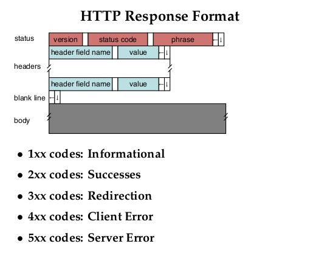

# HTTP란?

HTTP(Hyper Text Transfer Protocol)란 도대체 무엇일까? 우선 위키백과를 찾아봤다.

- W3 상에서 정보를 주고받을 수 있는 프로토콜, HTML문서를 주고받는 데 쓰임

- 클라이언트와 서버 사이에 이루어지는 요청/응답 **프로토콜**이다.

---

**프로토콜이 뭐지?**

- 컴퓨터와 컴퓨터 사이, 또는 한 장치와 다른 장치 사이에서 데이터를 원활히 주고받기 위하여 약속한 여러 가지 규약. 이 규약에는 신호 송신 순서, 데이터 표현법, 오류 검출법 따위가 있다. (네이버 국어사전)

---

- 클라이언트인 웹 브라우저가 HTTP를 통하여 서버로부터 웹페이지(HTML)나 그림 정보를 요청하면, 서버는 이 요청에 응답하여 필요한 정보를 해당 사용자에게 전달하게 된다.
- HTTP를 통해 전달되는 자료는 http: 로 시작하는 **URL**로 조회할 수 있다.

---

**URL이 뭐지?**

Uniform Resource Locator 또는 Web address. 네트워크 상에서 자원이 어디 있는지를 알려주기 위한 규약. 쉽게 말해 웹 페이지를 찾기 위한 주소를 말한다. URL은 꼭 웹 주소뿐만 아니라 컴퓨터 네트워크상의 자원을 모두 나타낼 수 있다. 그 주소에 접속하려면 해당 URL에 맞는 **프로토콜**을 알아야 하고, 그와 동일한 **프로토콜**로 접속해야 한다.

---

정리해보면, HTTP는 **요청과 응답을 주고받기 위한 사용자간 약속**이라고 할 수 있을 것 같다.

응답 메시지와 서버 응답에 대한 글이 있는데, 아직 알 필요는 없을 것 같아 일단 생략한다.

응답 코드에 대해서는 몇 가지 알아두면 좋을 것 같아 추가해본다.

- 1XX: 정보 교환
  - 100, 101 등이 있음. 필요하면 찾아보자.
- 2XX: Success, 데이터 전송이 성공적으로 이루어짐
  - 200: 오류 없이 전송 성공
  - 나머지도 모두 성공을 나타내지만 일부만 전송되거나, 전송할 데이터가 없는 경우도 있다.
- 3XX: 자료의 위치가 바뀌었음
  - 300: 최근에 옮겨진 데이터를 요청
  - 나머지는 필요하면 찾아보자.
- 4XX: 클라이언트 오류(요청하는 측에서 잘못한게 있음, 혹은 주소를 잘못 입력함)
  - 400: 요청 실패, 문법상 오류가 있어서 서버가 요청사항을 이해하지 못함
  - 403: Forbidden, 관계자 외 출입금지
  - 404: Not found, 문서를 찾을 수 없음. 서버에서 클라이언트가 요청한 파일이나 스크립트를 찾지 못함. (그냥 주소 잘못 입력했을 때)
  - 그 외 너무 많다. 상황이 닥치면 찾아보자.
- 5XX: 서버 측의 오류로 올바른 요청을 처리할 수 없음.
  - 500: Internal Server Error, 서버 내부 오류
  - 501: 필요한 기능이 설치되지 않았음.
  - 502: Bad Gateway, 게이트웨이 상태 나쁨.

출처 - [위키백과](https://ko.wikipedia.org/wiki/HTTP)

생활코딩님의 강의를 보고 간략하게 정리해보자.

# 생활코딩

## HTTP-1 수업소개

HTTP는 처음에 GET이라는 프로토콜밖에 없었고, HTML만 전송하는 프로토콜이었으나, 웹이 발전하면서 더욱 다양한 기능을 가진 프로토콜로 발전하게 되었다.

## HTTP-2 소개

HTTP란 무엇인가? 비유적인 이야기를 해보자. 클라이언트가 서버에게 HTML이라는 물건을 달라고 하려면 클라이언트는 서버에게 "HTML 주세요" 라고 해야 하는데, 이를 Request라고 하고, "여기 있습니다." 하는 것이 Response이다. 컴퓨터가 어떠한 컨텐츠를 주고받기 위해서는 **서버와 클라이언트가 서로 알아들을 수 있는 공통의 약속인 메세지**가 필요한데, 그 약속을 HTTP라고 하고, **HTTP는 크게 Request와 Response를 위한 메세지로 구분되어 있다!**

대부분의 브라우저에서 개발자 도구를 지원한다. 보통 F12를 누르면 열 수 있다. 열어서 Network 탭을 보면, 서버와 클라이언트가 주고받는 메세지를 감청할 수 있다. 

여기서 Headers를 열어서 살펴보자.

- Request Headers: 우리의 웹브라우저가 웹 서버에게 요청한 데이터!

  - 나는 찾지 못했지만, view source를 통해 코드를 보면, GET, Host라는 부분을 볼 수 있다고 한다.
  - GET /1. html HTTP/1.1  --> 내가 사용할 수 있는 통신 방법은 HTTP/1.1이다!
  - Host: location:8080 웹브라우저가 어떤 웹 서버의 주소로 접속했는지가 나옴

  위 두 줄이 필수적인 정보이다.

- Response Headers: 응답 부분

  - HTTP/1.1 200  OK --> 나도 HTTP/1.1을 사용할거고, 성공적으로 요청을 받았어! (필수)
  - Content-Type: text/html  --> 응답 정보가 text이고, 그 중 HTML이다!

- 사용자가 요청한 정보를 서버에 대신 물어봐주는 클라이언트!

- **웹 서버는 자기가 갖고 있는 정보를 보내주면서 Responsse Header를 만들어주는 기계라고 할 수 있고, 웹브라우저는 그러한 응답 정보를 화면에 적당히 그려주는 프로그램이라고 할 수 있다!**

## HTTP-3 Request message

### Request Line - GET /1.html HTTP/1.1

**GET**

- 웹 서버가 어떤 방식으로 통신할 것인가

- GET은 우리가 데이터를 웹 서버로부터 가져올 때 쓰는 것. 우리가 주소를 치고 enter를 치면 GET 방식으로 가져온 것이다!

  *로그인 화면 등에서 전송 버튼을 누르는 행위는 POST라고 한다.

**1.html**

- 웹 브라우저가 요청한 정보

**HTTP/1.1**

- 웹 브라우저가 사용할 수 있는 HTTP 방식이 1.1이다!

### Request Headers - Host 부분 이하

**Host: localhost:8080**

- 웹 사이트의 웹 서버의 주소를 적은 것
- 호스트가 있으면 하나의 웹 서버가 여러 개의 도메인을 서비스 할 수 있다.
- A라는 웹 서버가 A.com, B.com, C.com을 호스팅하고 있고 각각의 주소별로 다른 웹 사이트라고 한다면 웹 서버는 여기에 적혀 있는 주소가 무엇이냐에 따라 다른 정보를 보내줄 수 있다.
- 8080부분은 port 라고 하는데, 한 대의 컴퓨터에는 여러 대의 서버가 배치되어 있을 수 있고, 8080이라고 하는 port 번호에 등록되어 있는 웹 서버를 의미한다. (넘어가도 됨)

**User-Agent**

- 웹 브라우저의 다른 표현
- 요청하는 웹 브라우저가 어떤 웹 브라우저인지 보여준다.
- 사용자의 운영체제 정보나 웹 브라우저 이름 등의 정보를 알 수 있다.
- 필요하다면 내 사이트를 이용하는 사람들의 정보를 통계내는 데 사용할 수 있고, 만약 검색엔진 로봇이 접근하는 것 등을 차단하고 싶다면 이 정보를 이용하면 된다.

**Accept-Encoding**

- 웹 브라우저와 웹 서버가 서로 통신할 때 그 데이터의 양이 많으면 그걸 압축해서 전송하면 웹 브라우저가 풀어서 전송하는 방식을 적어놓음. gzip, deflate, br 등.. 여러 방식이 있고, 웹 브라우저는 자기가 선호하는 방식으로 정보를 압축하여 전송함

**If-Modified-Since: 날짜 정보**

- 지금 1.html이라는 파일을 요청해서 이미 가지고 있는데, 다시 요청하는 경우도 있을 것이다. 그런데 그 때마다 새로 파일을 보내주면 비효율적이다.  이를 해결하기 위해 날짜 정보를 확인하여 웹 서버는 응답할 때 자기가 갖고 있는 파일이 더 최신이면 보내주고, 그렇지 않으면 그냥 전송하지 않는다!

## HTTP-4 Response message

### status

서버가 응답했을 때 이게 잘 되었는지 알려주는 자세한 정보(앞서 알아본 200, 404, 502 등)

- version: HTTP version
- status code: 응답 결과
- phrase: 응답 결과를 사람이 이해하기 쉽도록 풀어쓴 것

[List of HTTP status codes](https://en.wikipedia.org/wiki/List_of_HTTP_status_codes)

### headers

**Content-Type**: text/html 혹은 image/jpeg 등..

- 웹 서버가 응답할 때 이 응답은 text고, HTML이라는 언어이다! 라고 써있으면 웹 브라우저가 이를 참고하여 해석해서 화면에 띄워준다.

**Content-length**: 1434 등의 byte 정보

- 응답하는 컨텐츠의 전체 크기는 1434byte 이다.

**Content-Encoding**: gzip

- 컨텐츠를 gzip이라는 방식으로 압축했으니까, 이걸 읽으려면 gzip으로 본문을 풀어서 읽어라!

**Last-modified**: 날짜 및 시간 정보

- 이 정보가 언제 수정되었는지 알려줌

## HTTP-5 수업을 마치며

궁금할 만한 것들!

### HTTP와 HTTPS의 차이?

- 주소가 HTTPS로 시작한다면 HTTPS 또는 SSL(같은 것)을 이용하는 중! s는 Secure의 약자로, 안전하다는 뜻이다. 웹에서 보안이 중요해진 이후 만들어짐.

- HTTPS를 이용하면 전송하고 있는 내용을 가로채더라도 그 안에 무슨 내용이 담겨있는지는 당사자들만 알 수 있다. 
- 따라서 HTTPS가 아닌 사이트에서 로그인을 요구한다면 우리는 그 사이트를 이용해선 안된다. 정보보안에 대한 생각이 없는 것이기 때문!

### cache?

- 한 번 웹 사이트에 접속해서 어떤 내용을 다운로드 받았다면, 다시 접속할 때 다시 받을 필요가 있을까?
- 이미 저장되어 있는 파일을 읽어서 성능을 향상시키는 방법!
- 내용이 갱신되었을 때도 웹 브라우저는 그 사실을 알아채지 못하기 때문에 필요하다면 사용자가 직접 캐시를 갱신해 줄 수 있다. 윈도우의 경우 ctrl+F5
- cache-control pragma - 캐시를 제어하는 헤더값

### 개인화?

- 쇼핑몰 로그인하고 끈 다음에 다시 들어가도 접속이 유지되는 경우, 웹사이트와 웹브라우저가 이러한 정보를 기억하고 있기 때문이다.
- 이걸 가능하게 하는 기술이 **cookie**이다.
- cookie 값을 웹 브라우저에 설정하면 접속할 때마다 설정해놓은 쿠키 값을 서버에 전송하여 사용자의 상태를 유지할 수 있고, 사용자를 식별할 수 있다.
- 최근에는 cookie보다 훨씬 많은 정보를 저장하면서도 보안적으로 우수한 **Web Storage**라는 기술이 등장!

### proxy?

- 웹 브라우저와 웹 서버 사이에 프록시라고 불리는 중계 서버를 둘 수 있다. 중간에 있는 서버가 캐시를 대신 해주거나 보안 공격을 막아주거나, 사용자 요청을 여러 대의 서비스로 분산해주는 등의 역할을 프록시 서버들이 대신 해 줄 수 있다.
- 서비스가 복잡해지고 중요해지고 있다면 이 기술을 알아보자.

### 네트워크를 모니터링 하는 도구들!

#### 1. 개발자 도구 > Network

#### 2. WIRESHARK

- HTTP뿐만 아니라 컴퓨터에서 일어나는 모든 네트워크 트래픽을 감시할 수 있는 도구
- 배우기 어렵고 복잡하지만 익숙해지면 유용하다.