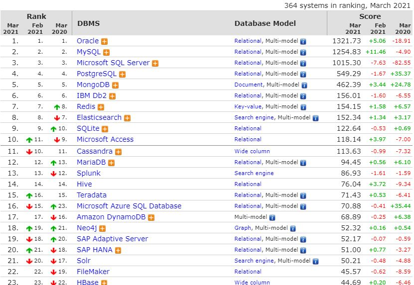

# Database by 생활코딩

다양한 데이터베이스를 관통하는 가장 본질적인 기능들을 살펴보자.


# 데이터베이스의 본질

### 입력

Create

Update

Delete


### 출력

Read


네 가지 작업을 줄여서 CRUD라고 부른다.


# file vs database

데이터를 파일화하여 정리해둔다고 해보자. 예를 들어 그 내용은 다음과 같다.

```
# MySQL.txt
MySQL is ... # 내용

2018.1.1 # 날짜
egoing # 작성자
developer # 직업
```

이러한 내용이 담긴 텍스트 파일이 수십 수백개 있다고 하자. 이 파일들 중에서 작성자가 egoing인 것만 보고 싶다면 어떻게 할 것인가? 날짜가 1월 1일인 것만 보고 싶다면?

파일로 정리한 경우에는 이러한 정렬에 있어서 문제가 발생할 수 있다. ex) egoing이라는 단어가 내용에 들어가 있어도 검색이 된다던지 하는 문제!

이 경우 문제 해결을 위해 우리는 스프레드시트를 떠올린다. 

| id   | title      | description       | created   | author | profile       |
| ---- | ---------- | ----------------- | --------- | ------ | ------------- |
| 1    | MySQL      | MySQL is ...      | 01/01/18  | egoing | developer     |
| 2    | Oracle     | Oracle is ...     | 01/03/18  | egoing | developer     |
| 3    | MongoDB    | MongoDB is...     | 2018.1.10 | duru   | data engineer |
| 4    | PostgreSQL | PostgreSQL is ... | 01/12/18  | taeho  | data engineer |
| 5    | Cassandra  | Cassandra is ...  | 01/20/18  | egoing | developer     |
| ...  | ...        | ...               | ...       | ...    | ...           |

흔한 엑셀 프로그램의 경우 filter나 sort 기능을 이용해서 원하는 방식으로 정렬을 할 수 있다. 데이터를 정리정돈 해 놓으니까 데이터를 가종하는 것이 훨씬 쉬워졌다.

file -> Spreadsheet -> Database

스프레드시트는 데이터베이스로 가는 길목에 있다.

데이터베이스 프로그램은 컴퓨터 언어를 이용해서 데이터를 관리할 수 있도록 만들어주며, 이는 자동화에 큰 도움이 된다.


# 어떤 데이터베이스를 공부할 것인가?



Oracle, MySQL은 관계형 데이터베이스이고, 관계형 데이터베이스가 아닌 것도 여럿 있다.

Oracle: 관공서, 대기업.. 비싸다. 데이터의 신뢰성이 중요한 경우

MySQL: 무료, 오픈소스. 데이터의 신뢰성이 떨어지는 경우

MongoDB: 관계형 데이터베이스가 아니다. 관계형 데이터베이스가 아닌 데이터베이스도 많이 성장하고 있기 때문에 한번 배워보는 것이 좋다.


내가 일하게 될 곳에서 다루는 것을 공부하자.

